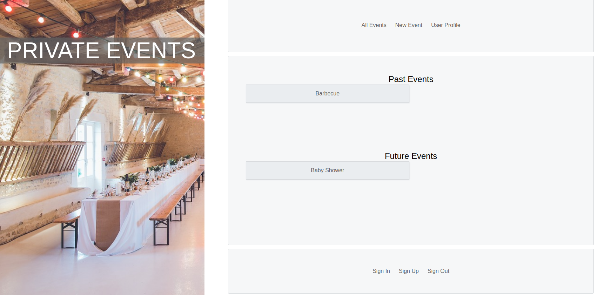

# Private Events

Private Events is a Rails website, which is similar to Eventbrite and allows users to create events, attend events, and view past/future events. 

## Demo

## Live

Play around with the [live version deployed on Heroku](https://agile-fortress-68521.herokuapp.com/events) . Create new events, attend events, and view attendance by singing in with the username: `test@gmail.com` and the password: `testtest`, or feel free to create your own User!

## Features

- Future addition: Increase performance and eliminate N+1 query problem through the use of eager loading
- Authenticate user data with Devise to ensure client privacy
- Use MVC design pattern to separate Models and Views from Controllers for ease of code maintainability
- Increase stylistic flexibility by composing project layout without a framework, using both Flexbox and Grid
- Increase security by utilizing Controller strong parameters and before_action user authentication
- Access PostgreSQL database through Active Record Queries
- Allow for interaction with the table joining Events and Attendees by creating a has many through association
